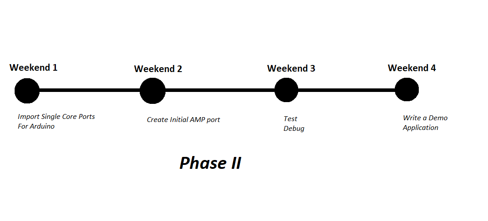
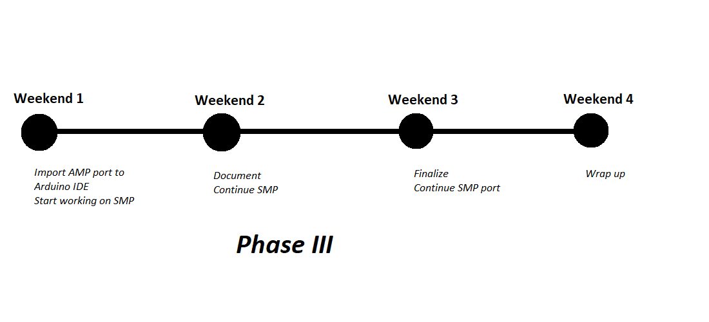

# Porting of FreeRTOS for Portenta
- [Porting of FreeRTOS for Portenta](#porting-of-freertos-for-portenta)
  - [Abstract](#abstract)
  - [Technical Details](#technical-details)
    - [Real-Time Operating Systems](#real-time-operating-systems)
      - [Kernel](#kernel)
        - [Tasks](#tasks)
        - [Queues and Scheduler](#queues-and-scheduler)
        - [Handlers](#handlers)
        - [Semaphores and Event Flags](#semaphores-and-event-flags)
        - [Multi-core Systems](#multi-core-systems)
    - [FreeRTOS](#freertos)
      - [Architecture](#architecture)
        - [Source Code Organization](#source-code-organization)
      - [Creating a New Port](#creating-a-new-port)
      - [Modifying a FreeRTOS Demo](#modifying-a-freertos-demo)
  - [Approach to the Project](#approach-to-the-project)
    - [Project Breakdown](#project-breakdown)
      - [Research](#research)
        - [FreeRTOS](#freertos-1)
      - [Portenta](#portenta)
      - [Single Core Ports](#single-core-ports)
      - [Multi-Core Ports](#multi-core-ports)
    - [Schedule of Deliverables](#schedule-of-deliverables)
      - [Community Bonding Period](#community-bonding-period)
      - [Phase 1](#phase-1)
      - [Phase 2](#phase-2)
      - [Final Week](#final-week)
  - [After GSoC](#after-gsoc)
  - [`Current Progress`](#current-progress)
  - [Development Experience](#development-experience)
  - [Other Experiences](#other-experiences)
  - [Reason for Selection of This Project](#reason-for-selection-of-this-project)
  - [Other Commitments](#other-commitments)
  - [About Me](#about-me)
  
## Abstract

The problem at hand is to port the widely used FreeRTOS to the new architecture of Arduino, the **Portenta** board.
FreeRTOS is cross-platform and is heavily ported to different systems and architectures. The ports are compiler and architecture dependent and new port is done by modifying an existing port for same compiler or architecture.

Portenta consists of STM32H747 processor that is composed of 2 cores Cortex M4 and M7. Hence, the problem extends to multi-core porting of FreeRTOS. Any multi-core port can be Asymmetric or Symmetric Multiprocessing Port. AMP consists of separate RTOS for each core whereas SMP consists single RTOS for both ports.

The proposed method of approach to the problem is to first port FreeRTOS to each core separately and finally create an AMP port; modifying the existing ports.

## Technical Details

### Real-Time Operating Systems

Real-Time Operating Systems are tasked with ensuring that *Each task being executed in precise amount of time to meet their deadlines.* RTOS takes the benefit of this time management to run more than one task concurrently.

Though there are more than 1 tasks running at the same time, multitasking for a single cored processor is not possible as processors and controllers work sequentially. So what RTOS does is interleaves more than one processes instead of running 2 or more processes simultaneously as in multitasking.

#### Kernel

Kernel is the core component of the operating system that deals with hardware control directly. Hence, it provides a level of abstraction between hardware and application software. In case of RTOS the hardware dependent activities like memory allocation, context switching task management and interrupt handling are carried out by the Kernel

##### Tasks

Tasks, also referred to as threads, are the jobs to be done by the processor. They are, in general, normal code similar to that of single sequential program and hence are executed similarly. But in case of RTOS when a task goes idle (eg. delay on the task), the OS saves its state and starts another task. As soon as the delay period ends the state of 2nd task is saved and that of 1st is restored. This task switching is known as **Context Switching** where the Context refers to the state of registers and flags.

Thus, each task comes with a state that includes *program counter*, *registers*, *status and flags*. In addition to this a task also has its own associated *stack*. The collection of such information along with the pointer to the address of previous and next tasks' information is stored in a block of memory referred to as **Task Control Block (TCB)**.

Upon creation of a task, certain portion of memory is allocated for the TCB and the stack. A task can be in either of 4 states: **Running**, **Ready**, **Waiting** and **Dormant**.

##### Queues and Scheduler

The task of determining the task to run is done by Scheduler. It selects the task to run from the queue of tasks, ready to run (usually from the head) applying *Priority based First Come First Serve*.

The concept of queue is extensively used in RTOS. The queues are maintained in a priority basis, i.e. the higher priority tasks are queued in front of low priority ones indifferent to the time of enqueuing and those with the same priority are queued together based on time of enqueuing.

##### Handlers

Handlers provide feature extension of processor and are generally event triggered. They, upon certain event, are executed first, halting the current task which is like saying handlers have higher priorities than tasks. General Handlers are:

* Interrupt Handler
* Cyclic Handler
* Exception Handler

##### Semaphores and Event Flags

Semaphores are the objects that ensure the mutual exclusion between tasks while accessing shared resources. The task that has a semaphore gets to access a certain resource. A task requests for semaphore and if the semaphore is already taken then it is placed in a queue, and its state is changed to waiting.

Event Flags are the method implemented for inter-task communication. The running task can raise a Event Flag, providing a code. The task whose Event ID matches the Event Flag (code) becomes ready for execution.

##### Multi-core Systems

For multi-core systems, various approaches are taken as:

* **Symmetric Multiprocessing (SMP):**

  - Single Operating System and shared memory
  - Multiple processors and caches

* **Asymmetric Multiprocessing:**

  - Multiple processors and Operating Systems

### FreeRTOS

FreeRTOS is a cross-platform RTOS Kernel written in C and distributed freely under MIT open source license. It is architecturally divided into two layers, the “hardware independent” layer: responsible for performing the majority of operating system functions, and the “portable” layer: responsible for performing hardware–specific processing (such as context switching).

#### Architecture

1. list.c: *List data structure used by the Scheduler*
2. tasks.c: *Task management functionality*
3. queue.c: *Priority based queue data structure for message passing*
4. timers.c: *Software based timer functionality*
5. croutine.c: *Provides support for co-routines and Event Flags*
6. port.c: *Exposes standard portable API required by hardware independent layer*
7. heap.c: *Port specific memory allocation and deallocation functionalities*

##### Source Code Organization

* FreeRTOSPLUS:               `Code for FreeRTOS+ Components`
* FreeRTOS:                   `FreeRTOS Source Code`
  - License
  - Demo:                     `Application to Demonstrate Use of FreeRTOS`
    - Common:                 `Files Used by all Demo Applications`
    - Demo x:                 `Demo Application for X`
    - Demo y:                 `Demo Application for Y`
  - Source:                   `Core Kernel Components Common to all Ports`
    - include:                `Real Time Kernel Header Files`
    - portable:               `Port Files Specific to a Compiler and Microcontroller`
      - MemMang:              `Sample Memory Allocators`
      - [compiler]:           `Port Files Specific to the Compiler`
        - [Architecture]:     `Port Files Specific to the Architecture`

#### Creating a New Port

These are the basic steps for creating a fresh FreeRTOS port and are based on [Creating a New FreeRTOS Port](https://freertos.org/FreeRTOS-porting-guide.html) from FreeRTOS website.

Required Directory Structure:

* Source/tasks.c
* Source/Queue.c
* Source/List.c
* Source/portable/[compiler name]/[processor name]/port.c
* Source/portable/MemMang/heap_1.c or heap_2.c or heap_3.c or heap_4.c
* Demo/[processor name]/main.c
* Demo/Common

1. Create *port.c* and *portmacro.h* files based on pre-existing demos that contain just stubs of functions and macros.
2. Based on the stack of selected microcontroller set portStack_Growth in portmacro.h to -1 (downward - high to low ) or 1 (upward - low to high)
3. Copy existing  *FreeRTOSConfig.h* and *main.c* files and edit them to be just stub files
4. Change *FreeRTOSConfig.h* file based on choosen hardware
5. Rest of the files are common to all ports, so copy as they are

#### Modifying a FreeRTOS Demo

These are the basic steps for creating a fresh FreeRTOS port and are based on [Modifying a FreeRTOS Demo](https://freertos.org/porting-a-freertos-demo-to-different-hardware.html) from FreeRTOS website.

1. Identify *controller specific* and *compiler specific* FreeRTOS Kernel files
2. Copy existing low level files (C startup file and linker script)
3. Configure Project Settings in *portmacro.h*
4. Configure tick interrupt in *port.c*
5. Configure RAM and ROM usage in *FreeRTOSConfig.h* and *Memory Management* files

## Approach to the Project

### Project Breakdown

#### Research

##### FreeRTOS

1. Familiarize with FreeRTOS:

   - Port FreeRTOS to Arduino Uno using Richard Barry's Library.
   - Port FreeRTOS to STM32F407 Discovery using STMCUBE32MX.

2. Familiarize with the Porting process:

   - [Modify](#modifying-a-freertos-demo) existing demos for porting FreeRTOS to STM32F407 Discovery:

      - [Demo for STM32F407ZG-SK using IAR](https://freertos.org/FreeRTOS-for-STM32F4xx-Cortex-M4F-IAR.html)

      - [Demo for SAM4S ARM Cortex-M4 microcontroller using Atmel Studio 6 IDE](https://freertos.org/Atmel_SAM4_SAM4S-EK_RTOS_Demo.html)

   - [Create new ports](#creating-a-new-port) for STM32F407 Discovery:

      - Using the above mentioned demo projects as references

3. Multi-core Support of FreeRTOS:

   - Research different multi-core implementation of FreeRTOS
   - Formulate a detailed *Implementation* *Approach* for multi-core implementation (especially SMP)
   - Probable references:

      - [Adapting FreeRTOS for Multi-core: an Experience Report](https://www.cs.york.ac.uk/fp/multicore-freertos/spe-mistry.pdf)

      - [Simple Multi-core Core to Core Communication Using FreeRTOS message buffers](https://www.freertos.org/2020/02/simple-multicore-core-to-core-communication-using-freertos-message-buffers.html)

      - [ST STM32H745 Dual Core AMP Demo ](https://www.freertos.org/STM32H7_Dual_Core_AMP_RTOS_demo.html)

#### Portenta

1. Study the architecture and organization of Portenta Board for the features like:

   - Multi-core Organization
   - Shared Resource
   - Core Specifications

#### Single Core Ports

1. Cortex-M4

   - [Modify](#modifying-a-freertos-demo) existing demos of Cortex-M4 for porting it to single core of Portenta
   - Debug
   - [Create a new port](#creating-a-new-port) for Arduino IDE based port for Cortex-M4 taking [Richard Barry's Library](https://www.arduinolibraries.info/libraries/free-rtos) as example
  
2. Cortex-M7

   - [Modify](#modifying-a-freertos-demo) created port for Cortex-M7 taking existing demos as references.
   - Debug

3. Document
  
#### Multi-Core Ports

1. Asymmetric Multiprocessor Port

   - [Modify](#modifying-a-freertos-demo) existing [ST STM32H745 Dual Core AMP Demo](https://www.freertos.org/STM32H7_Dual_Core_AMP_RTOS_demo.html) for STM32H747 based on IAR
   - [Create new port](#creating-a-new-port) for STM32H747 based on GCC
   - Debug
   - Write a Demo Application for the Port
   - Extend the port for extra features of FreeRTOS like croutine(Event Flags) and software timers
   - Document

2. Symmetric Multiprocessor port

   - Create a port based on the *Implementation Approach* formulated during research
   - Write a Demo Application for the Port
   - Document

### Schedule of Deliverables

#### Community Bonding Period

* Familiarize with Arduino Coding Standards
* Compete *FreeRTOS* portion of Research

#### Phase 1

* Implementation Approach for Multi-core Porting
* Preliminary Single Core Ports of FreeRTOS for Portenta
* Demo Application of Single Core Port for Portenta

#### Phase 2

* Preliminary Multi-core Port(AMP) of FreeRTOS for Portenta
* Arduino Library for Single Core Port with Demo Application

#### Final Week

* Arduino Library for Multi-core port of FreeRTOS(AMP)
* Preliminary SMP Port of FreeRTOS for Portenta (optional)

## After GSoC

Upon completion of this project, I plan to spend my time for the further extension of this project. I wish to work for:

* Extending the Single Core Port Library for Other ARM Architectures like Arduino DUE
* Extending the Multi-core Port based on SMP and other approaches

## [`Current Progress`](https://github.com/rijalbasanta/FreeRTOS)

## Development Experience

I have decent experiences of ***C/C++ coding, embedded programming for AVRs as well ARM, Arduino***. These experiences are a result of my involvement in academic projects as well as my involvement in **ROBOTICS CLUB** of my college. Every year the Club represents Nepal in **ABU ROBOCON**. I have been involved in the following projects:

* [MIPS Simulator](https://github.com/ABoredComputerEngineer/MIPS-Simulator)
* Arduino based Line follower
* Hardware Designs for Robots from Nepal for **ABURobocon** 2018 and [2019](https://github.com/rijalbasanta123/RB2019)
* Ongoing Embedded Programming for ABURobocon 2020 (*Includes Use of FreeRTOS*)
* Simple Visual Light Communication prototype with opamp only (no microcontroller)
* [Automatic Rocking Cot on Baby cry detection](https://github.com/rijalbasanta123/Automatic-Rocking-Cot)
* [Understanding 3d-Reconstruction](https://github.com/rijalbasanta/Computer-Graphics-074-BEX/tree/master/402_409_419_438_Understanding_3D_Reconstruction)
_Do you have experience with Arduino?_*

## Other Experiences

Being a Electronics and Communication Engineering Student, I've academically studied subjects related to Computing, Embedded Systems and all.

1. Studies related subjects:

   - C programming
   - C++ programming
   - Discrete Structure
   - Microprocessor (8085 and 8086)
   - Computer Organization and Architecture
   - Microprocessor based Instrumentation System

2. Intern as Hardware Engineer in *Prokura Innovations, Kupondole Lalitpur* from *January 2019 to March 2019*
3. Worked as *Build Executive* in *Mozilla Campus Club, Pulchowk Campus* from *June 2018 to June 2019*
4. Active member of *IEEE and Robotic and Automation Society (RAS)*
5. *Nominating Head* for the *IEEE Student Branch, IOE*

## Reason for Selection of This Project

The major reason for choosing this project is that it **corresponds to my another ongoing work** in Robotics Club of my college. I am currently working on programming of **STM32F407** in the robots for **ABU ROBOCON 2020**, after reaching a point RTOS can greatly improve the efficiency. The RTOS used is none other than **FreeRTOS** which my seniors implemented last year for **STM32F407**. This project obviously will help to familiarize with the FreeRTOS kernel, porting and its application. Hence, it will be helpful for my other project.

Also I've had the chance of practicing embedded programming, hardware designs and these fields interest me quite well.

## Other Commitments

Based on my college's academic calendar, during the GSoC Period, we have ongoing **classes** from **10:15 AM to 4:00 PM**. In addition to it, I am working in the **Robotics club** and it is where stay and sleep for the **non-academic hours**.

Given this project matches with my work in Robotics Club, I can surely **provide the required time for this project.** (about 5 hours regularly) 

But there is an issue, that is our ***exams*** those supposed to be over before 13th of April have been ***halted due to the Covid-19 Pandemic***. Because of the uncertainty surrounding the pandemic, nothing can be said for exact date of the exams. The exams, upon normal circumstances run for a period of a month. During this period, I might not be able give my full but will surely be working somewhat as there will be no classes.

The catch here is that **until the exams start**, I can **give my all to the project** as for this period I neither have any class nor any other commitments.

## About Me

* Name: Basanta Rijal
* Email: 074bex409.basanta@pacmpus.edu.np ;  rijalbasanta123@gmail.com
* Github: [rijalbasanta123](https://github.com/rijalbasanta123)   ;  [rijalbasanta](https://github.com/rijalbasanta)
* Phone no: 977-9868636692 ;  977-9806285592
* Address: Lalitpur, 44700, Nepal
* College: Central Campus, Institute of Engineering
* University: Tribhuwan University, Nepal